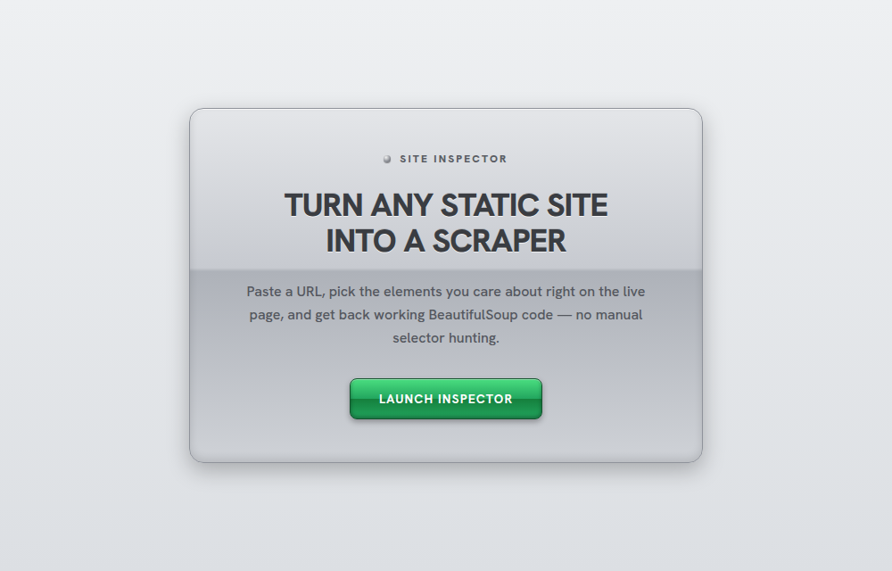
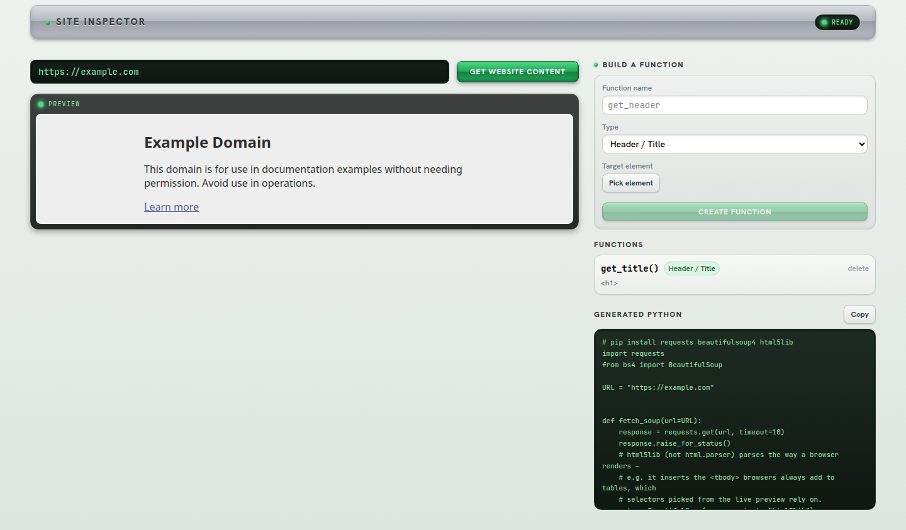
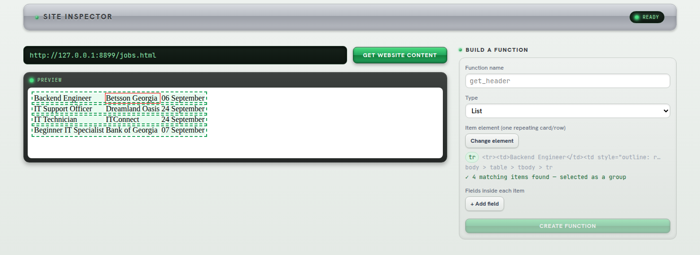

# VisualBs4Scraper

Turn any static site into a scraper: paste a URL, pick the elements you care about right
on the live-rendered page, and get back a real, runnable `requests` + `BeautifulSoup`
Python script — no manual selector hunting.

Docs site: https://darklordgeo.github.io/Staticbs4/

|  |  |
|---|---|
|  |  |



## How it works

1. **Paste a URL.** The backend fetches the page, strips scripts, and rewrites its
   asset URLs so it renders safely and faithfully in a live preview.
2. **Pick elements.** Click a header, a text block, a link list, a table, or one row of
   a repeating list (a jobs table, a card grid, ...) right on the rendered page. Picking
   one row of a list selects the *whole group* — every matching row gets highlighted and
   counted, not just the one you clicked.
3. **Get Python back.** Each picked element becomes a function in a generated
   `requests` + `BeautifulSoup` script, shown in a copyable panel.

## Structure

```
front/     React + TypeScript + Vite — the UI: picker, function builder, code generator
backend/   Flask + BeautifulSoup — fetches/bundles pages for the preview, proxies assets
```

Each has its own README with setup, scripts, and a Dockerfile:
[`front/README.md`](front/README.md) · [`backend/README.md`](backend/README.md)

## Running it

Both the backend and frontend run either locally or in Docker — pick one option per
side, mix and match if you like. Either way they reach each other the same way, via
`127.0.0.1`, so nothing else needs to change.

### Backend

**Option A — locally:**

```bash
cd backend
python3 -m venv .venv
source .venv/bin/activate
pip install -r requirements.txt
python Controller/app.py
```

**Option B — Docker:**

```bash
cd backend
docker build -t visualbs4scraper-backend .
docker run --rm -p 5000:5000 visualbs4scraper-backend
```

Either way, it's serving at `http://127.0.0.1:5000`.

### Frontend

**Option A — locally (dev server, hot reload):**

```bash
cd front
npm install
npm run dev
```

Open `http://localhost:5173`.

**Option B — Docker (production build, served by nginx):**

```bash
cd front
docker build -t visualbs4scraper-frontend .
docker run --rm -p 8080:80 visualbs4scraper-frontend
```

Open `http://localhost:8080`.

Whichever combination you pick, the frontend expects the backend at
`http://127.0.0.1:5000` (see the backend README's "Known limitations" section — this is
a local-dev tool, not hardened for public deployment). See
[`front/README.md`](front/README.md) and [`backend/README.md`](backend/README.md) for
more detail on each.

## Why `html5lib`

Selectors are picked against what a real browser renders — which isn't always what
`response.text` literally contains. Browsers silently normalize HTML (e.g. inserting an
implicit `<tbody>` into any table that doesn't have one); bs4's default `html.parser`
backend doesn't. Both the preview bundler and the generated Python parse with
`html5lib` instead, so a selector that matches in the picker also matches when the
generated script actually runs.
